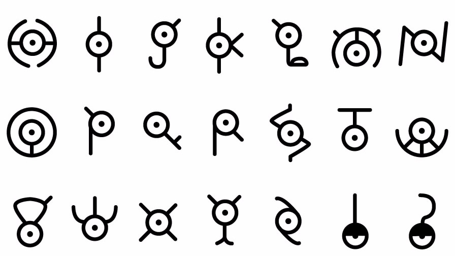

# Un-GAN
Unowns GAN generator, nothing more, nothing less...

_Generated ones:_  

The construction of the GAN is done in two steps (**progresive training**):  

**First step:  **

**Second step:**  

It does repeat many of the original shapes, but it is normal considering the few examples we have provided it with. Some new forms come up eventually.  

# COMENTARIOS 

Presentación:  
https://docs.google.com/presentation/d/1O7tvokOFY0WprF25QzxtgTfFmqiyF-eJRt6dczwxM_E/edit?usp=sharing
  
Notebook:  
https://colab.research.google.com/drive/1sNUToHPXnI9cOy5dR7IBrisQVxR4N9-O?usp=sharing
